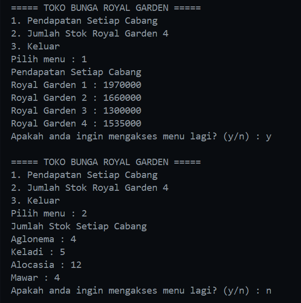
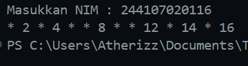
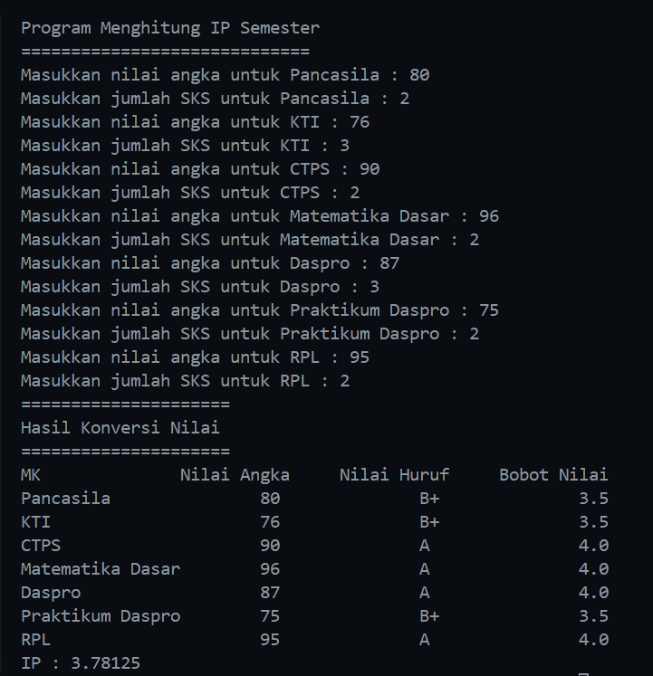
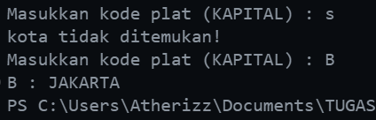
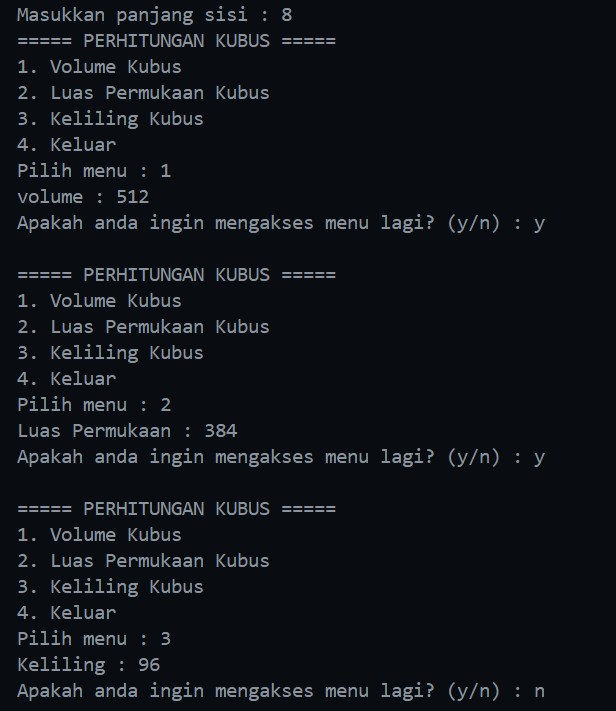

|  | Algorithm and Data Structure |
|--|--|
| NIM |  244107020116|
| Nama |  Savero Athallah Hardiana Putra |
| Kelas | TI - 1H |
| Repository | [link] (https://github.com/Atherizz/asd-sem2/tree/main/Jobsheet%201) |

# Labs #1 Programming Fundamentals Review

## 1. Pemilihan

The solution is implemented in Pemilihan.java, and below is screenshot of the result.

**Brief explanaton:** There are 4 main step: 
1. Input all grades
2. Validate the input
3. Calculate and convert the final grade
4. Decide the final status

## 2. Perulangan
The solution is implemented in Perulangan.java, and below is screenshot of the result.

**Brief explanaton:** There are 4 main step: 
1. Input NIM
2. take the last 2 digit from NIM by parseInt method
3. Make the condition while the number is odd and certain condition
4. print the output

## 3. Array
The solution is implemented in Array.java, and below is screenshot of the result.

**Brief explanaton:** There are 5 main step: 
1. Declare some variable to keep the array for the score, college subject, sks, etc 
2. Input the score and make a condition for the score between 0-100
3. make a condition to decide the score value and letter score
4. print the output
5. calcute the IP by the existing formula

## 4. Fungsi
The solution is implemented in Fungsi.java, and below is screenshot of the result.

**Brief explanaton:** There are 4 main step: 

1. Create the main menu
2. Declare some variable to keep the array for the sales report, price, flower type, etc.
3. create a function for keep each the income from all branch of the store by using a nested loop and add some logic 
4. create a function for reduce the "Royal Garden 4" stock based on the question by access the array and calculate the array

## 5. Tugas 1
The solution is implemented in Tugas1.java, and below is screenshot of the result.

**Brief explanaton:** There are 4 main step: 
1. Declare the array for corresponding city name and the plate code
2. Get user input for plate code and store in input variable
3. Loop through code array to find matching character and when found, set isFound to true
4. Print the code and corresponding city name

## 6. Tugas 2
The solution is implemented in Tugas2.java, and below is screenshot of the result.

**Brief explanaton:** There are 3 main step:
1. Getting the cube's side length from user input
2. Displays a menu with 4 options (Volume, Surface Area, Perimeter, Exit) using do-while loop. 
3. Contains three separate methods to calculate cube's volume, surface area, and perimeter using mathematical formulas.

## 7. Tugas 3
The solution is implemented in Tugas3.java, and below is screenshot of the result.

.png)
.png)
.png)

**Brief explanaton:** There are 4 main step:
1. Declaring arrays to store course details (name, day, semester, credits) and getting the number of courses from user.
2. Implements a menu with 6 options (Input Schedule, Show All, Search by Day, Search by Semester, Search by Course, Exit) using do-while loop.
3. Contains inputJadwal() method to get course details from user and store them in respective arrays.
4. Implements three different search methods (by day, semester, course name) with input validation and display functionality.

