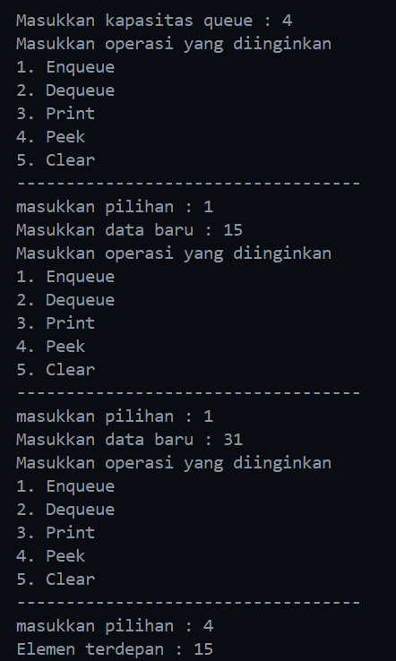
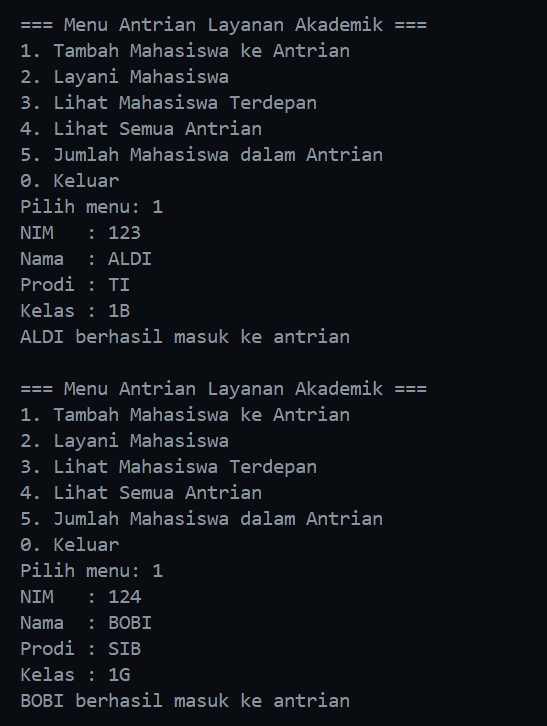
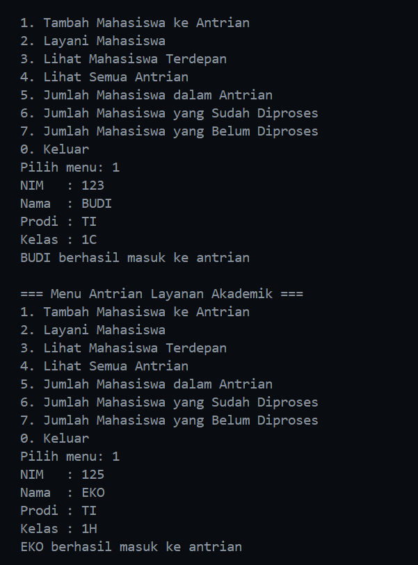
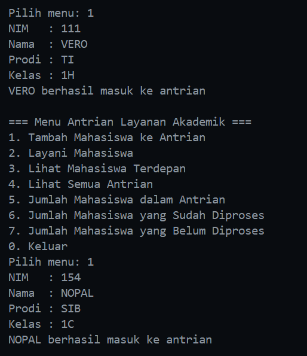
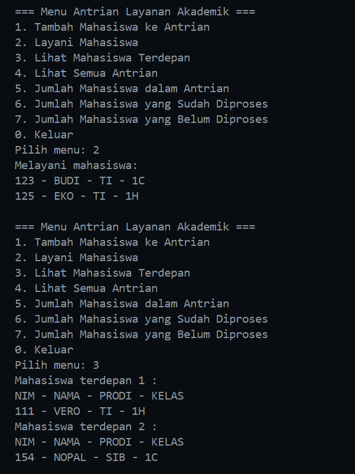
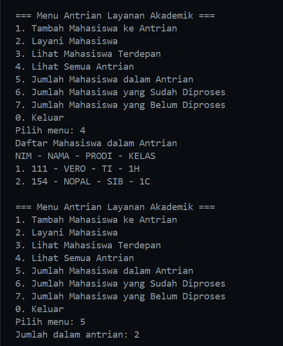
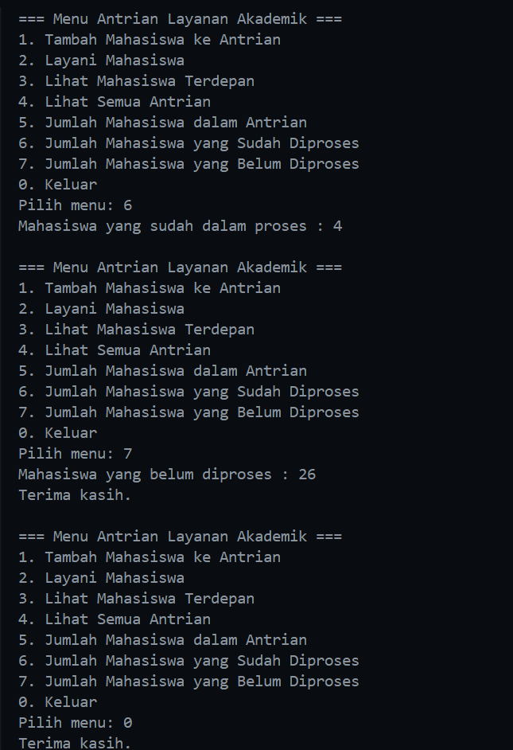

|  | Algorithm and Data Structure |
|--|--|
| NIM |  244107020116|
| Nama |  Savero Athallah Hardiana Putra |
| Kelas | TI - 1H |
| Repository | [https://github.com/Atherizz/asd-sem2/tree/main/Jobsheet%210]|

# Labs #10 Queue

## Operasi Dasar Queue

### 2.1.2 Verifikasi Hasil Percobaan 
  

### 2.1.3 Pertanyaan
1. karena pada saat inisiasi awal, data `queue` masih kosong, sehingga ditandai dengan front dan rearnya yang bernilai -1 (supaya tidak menandakan suatu index)

2. kondisi tersebut untuk menghandle ketika data paling belakang sudah penuh, data yang baru akan ditaruh pada index 0 (mengubah nilai front menjadi 0 terlebih dahulu)

3. kondisi tersebut untuk menghandle saat elemen di ujung dikeluarkan (dequeue), posisi front harus berputar kembali ke awal array (indeks 0).

4. karena data pada index ke-0 belum tentu ada isinya, data dimulai pada index `front` dan data yang paling belakang ada pada index `rear`

5. untuk menghandle data pada index sebelum rear yang melebihi max, ketika melebihi max maka index otomatis mulai dari 0 karena ada operasi modulus tsb.

6. Menunjukkan kode
```java
        if (isFull()) {
            System.out.println("Queue sudah penuh");
        } 
```

7. Modifikasi program
```java
        if (isFull()) {
            return;
        } 
```

## Antrian Layanan Akademik

### 2.2.2 Verifikasi Hasil Percobaan 

  
    

### 2.2.3 Pertanyaan  

Modifikasi Program
```java

            void lihatAkhir() {
            if (isEmpty()) {
                System.out.println("antrian kosong");
            } else {
                System.out.println("Mahasiswa terakhir : ");
                System.out.println("NIM - NAMA - PRODI - KELAS");
                data[rear].tampilkanData();
            }
        }
  ```

## Tugas

### Contoh Output 

  
    
      
        
          


