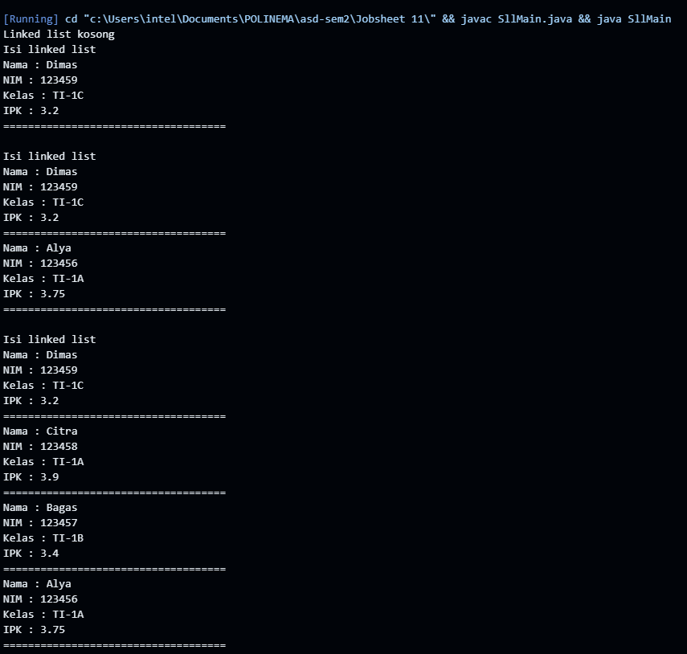
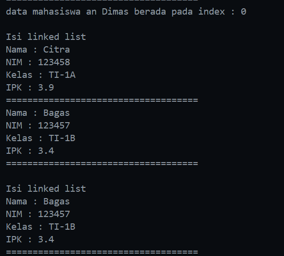
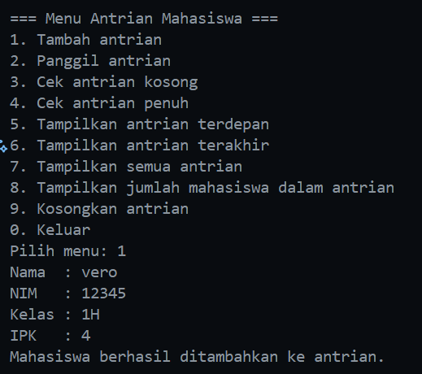
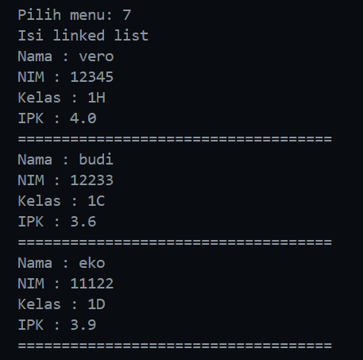
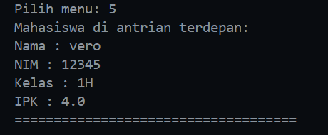
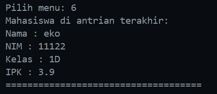
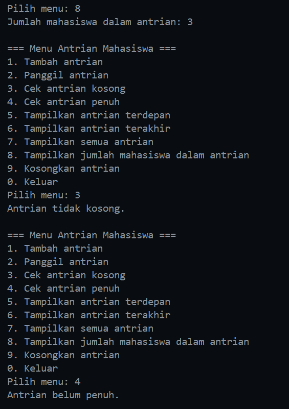
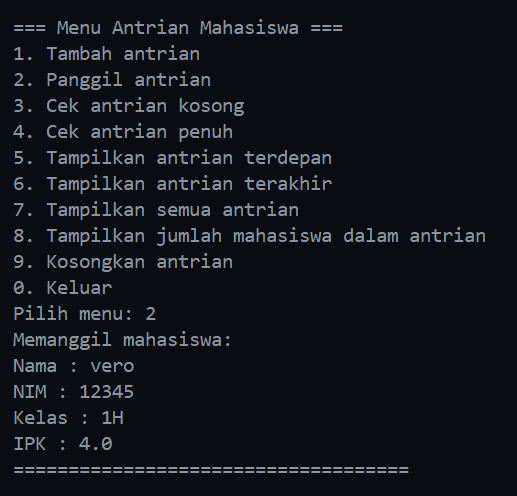
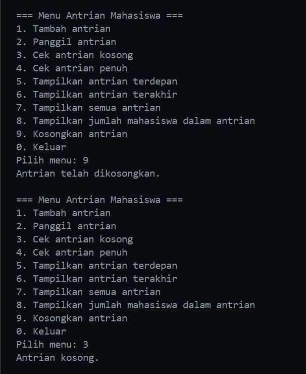

|  | Algorithm and Data Structure |
|--|--|
| NIM |  244107020116|
| Nama |  Savero Athallah Hardiana Putra |
| Kelas | TI - 1H |
| Repository | [https://github.com/Atherizz/asd-sem2/tree/main/Jobsheet%2011]|

# Labs #10 Linked List

## Pembuatan Single Linked List

### 2.1.2 Verifikasi Hasil Percobaan 
  

### 2.1.3 Pertanyaan
1. karena belum ada data yang ditambahkan melalui method `add` yang ada pada class `SingleLinkedList`

2. Variabel temp digunakan sebagai pointer yang merujuk pada attribut `head` pada class `SingleLinkedList`, kegunaan umumnya untuk melakukan penelusuran data dengan memanfaatkan atribut `next` untuk mengakses node selanjutnya.

3. Modifikasi program class `SllMain`
```java
        System.out.print("Berapa jumlah data mahasiswa yang ingin ditambahkan? ");
        int jumlah = sc.nextInt();
        sc.nextLine(); 

        for (int i = 0; i < jumlah; i++) {
            System.out.println("\nData Mahasiswa ke-" + (i + 1));
            System.out.print("Nama  : ");
            String nama = sc.nextLine();
            System.out.print("NIM   : ");
            String nim = sc.nextLine();
            System.out.print("Kelas : ");
            String kelas = sc.nextLine();
            System.out.print("IPK   : ");
            double ipk = sc.nextDouble();


            Mahasiswa25 mhs = new Mahasiswa25(nama, nim, kelas, ipk);
            sll.addLast(mhs); 
        }

        System.out.println("\nData Mahasiswa dalam Linked List:");
        sll.print();
    }

```


## Modifikasi Elemen pada Single Linked List

### 2.2.2 Verifikasi Hasil Percobaan 

  


### 2.2.3 Pertanyaan

1. keyword `break` pada method `remove` digunakan untuk keluar dari perulangan ketika salah satu dari kondisi tersebut sudah terpenuhi

2. Kode Program
```java
                    temp.next = temp.next.next;
                    if (temp.next == null) {
                        tail = temp;
                    }
```
Kode di atas merupakan proses memutus node setelah pointer `temp` dengan cara mengubah nilai attribut `next` menjadi objek setelah `temp.next`. Dan jika `temp.next` == `null` itu berarti data yang mau diubah berada pada posisi `tail` sehingga `tail` perlu diubah menjadi `temp` yang merupakan data sebelum `temp.next`.

## Tugas

### Contoh Output 

#### Menambahkan antrian
  

#### Menampilkan seluruh antrian
  

#### Menampilkan antrian terdepan
  

#### Menampilkan antrian terakhir
  

#### Menampilkan jumlah antrian, antrian kosong & penuh
  

#### Memanggil antrian
  

#### Mengosongkan antrian
  


