|  | Algorithm and Data Structure |
|--|--|
| NIM |  244107020116|
| Nama |  Savero Athallah Hardiana Putra |
| Kelas | TI - 1H |
| Repository | [https://github.com/Atherizz/asd-sem2/tree/main/Jobsheet%2012]|

# Labs #11 Double Linked List

## Percobaan 1

### 2.1.2 Verifikasi Hasil Percobaan 
  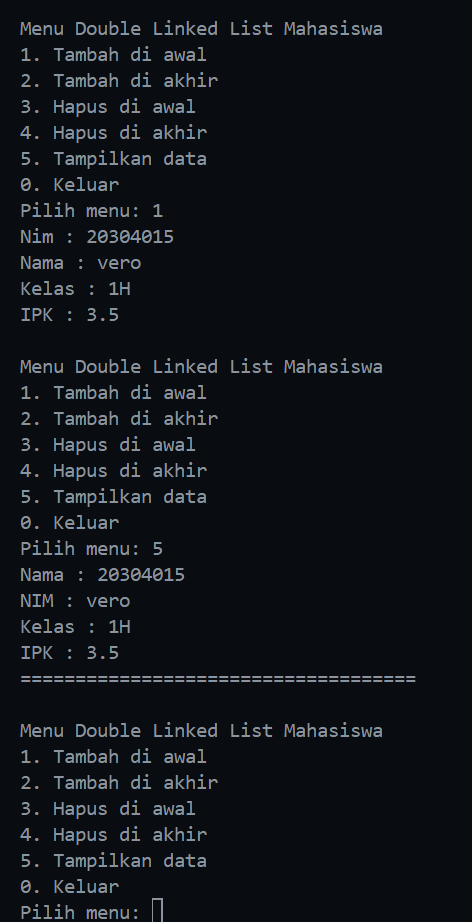

### 2.1.3 Pertanyaan
1. Single Linked List dan Double Linked List dibedakan dengan jumlah pointer yang ada di objek `Node`, seperti namanya Single Linked List hanya memiliki 1 attribute pointer yaitu `next` yang menandai objek setelah node itu sendiri sedangkan Double Linked List memiliki `prev` yang menandai objek sebelum node.

2. `next` berfungsi untuk menandai objek setelah node itu sendiri sedangkan `prev` berfungsi untuk menandai objek sebelum node. Keduanya merupakan pointer

3. konstruktor tersebut digunakan untuk menginisasi attribute `head` dan `tail` menjadi null, yang menandakan bahwa linked list tersebut masih kosong.

4. jika kondisi `isEmpty()` terpenuhi, attribute `head` dan `tail` akan langsung diisi dengan newNode, karena jika datanya hanya 1, otomatis value dari `head` dan `tail` akan sama

5. `head.prev` merupakan attribut pada node head (data pertama) yang menunjuk node sebelum data node tersebut, dengan statement tersebut, nilai dari `head.prev` akan diisi dengan `newNode` yang berarti `newNode` akan ditaruh di data paling depan.

6. Modifikasi fungsi `print()`
 ```java
    void print() {
        Node25 temp = head;
        if (isEmpty()) {
            System.out.println("Data kosong!");
            return;
        }
        while (temp != null) {
            temp.data.tampilInformasi();
            temp = temp.next;
        }
    }
```

7. `current.next.prev` = newNode`, kode program ini berguna untuk mengisi attribut `prev` pada node setelah `current` sehingga menghubungkan data setelah `current` dengan `newNode`

8. Modifikasi Program dan hasil output

## Kegiatan Praktikum 2

### 2.2.2 Verifikasi Hasil Percobaan 

  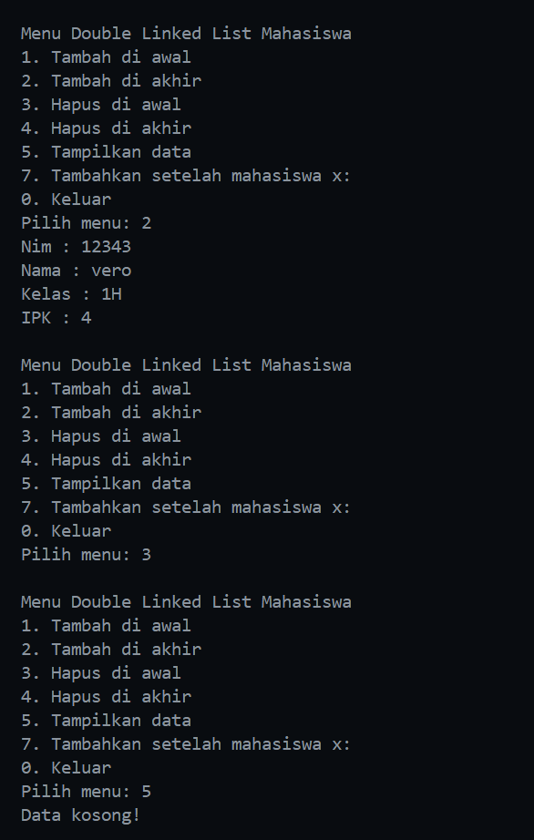

### 2.2.3 Pertanyaan

1. mengubah value dari attribute `head` menjadi node setelahnya yaitu dengan mengakses `head.next` dan mengubah value `head.prev` yang merupakan pointer ke node sebelumnya menjadi null

2. Modifikasi Program
  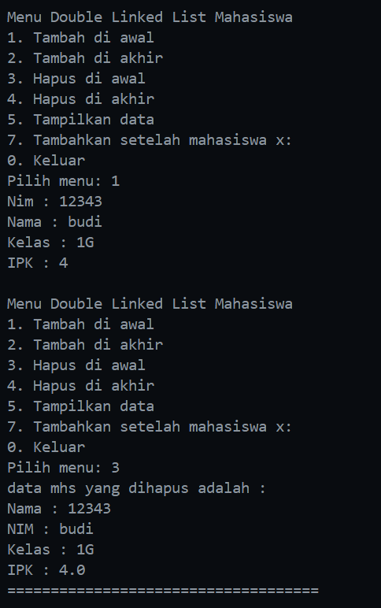

### 2.2.5 Tugas Praktikum

  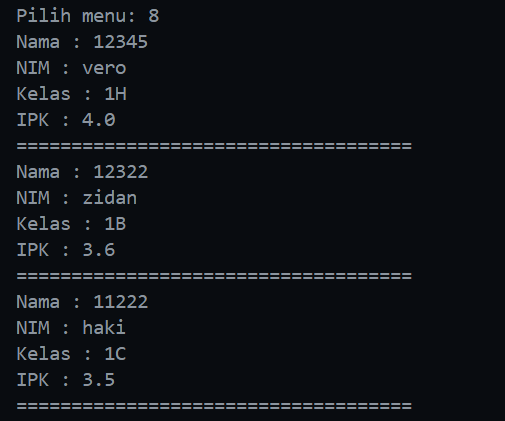


1. Fungsi `add`
  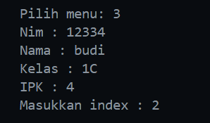
    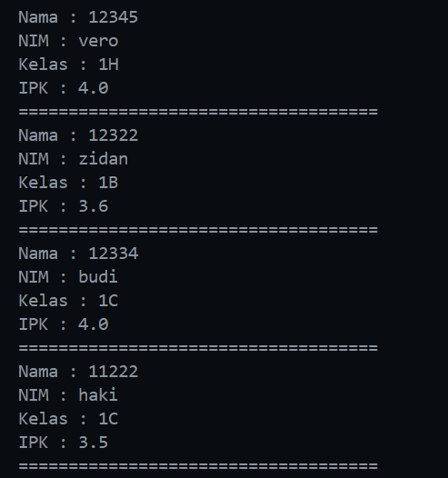

2. Fungsi `removeAfter`
    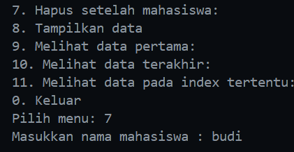
        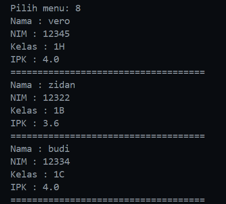

3. Fungsi `remove`
    

4. Fungsi `getFirst`
    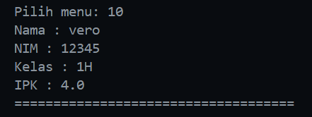

  Fungsi `getLast`
    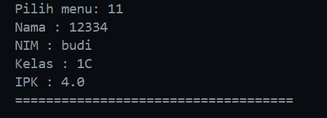

  Fungsi `getIndex`
    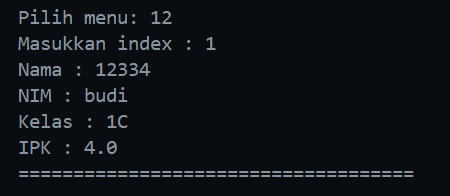

5. Fungsi `getSize`
    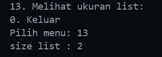


