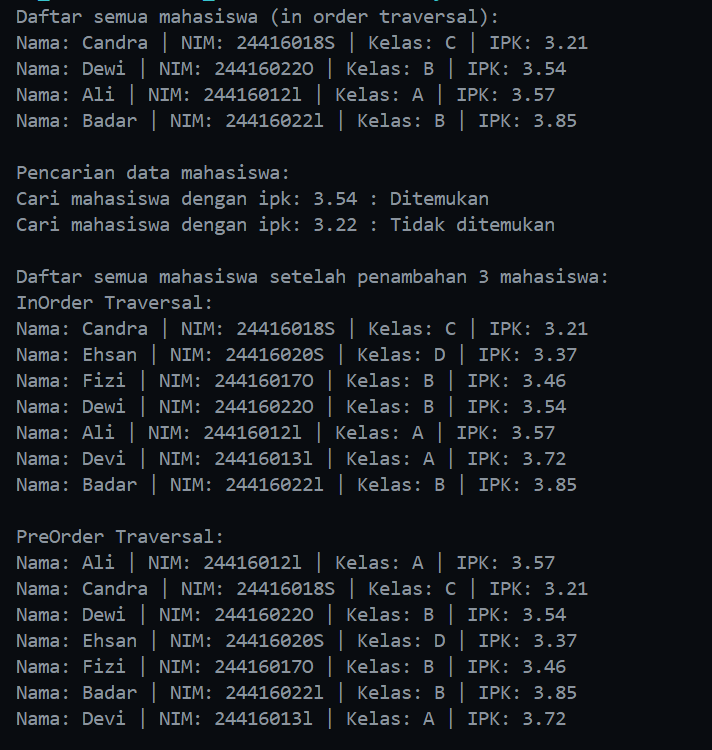
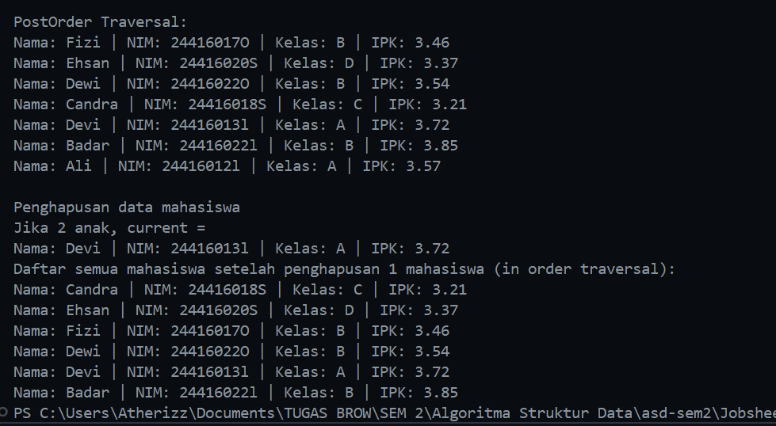
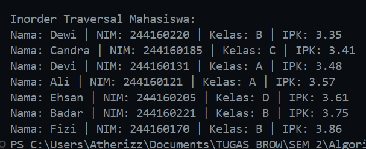
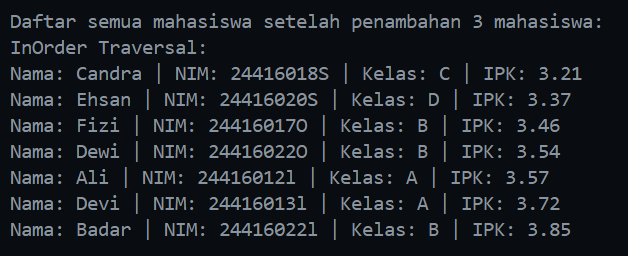
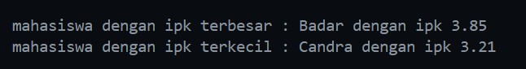
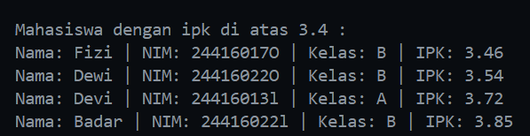
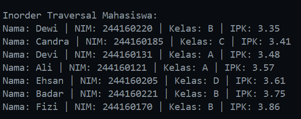
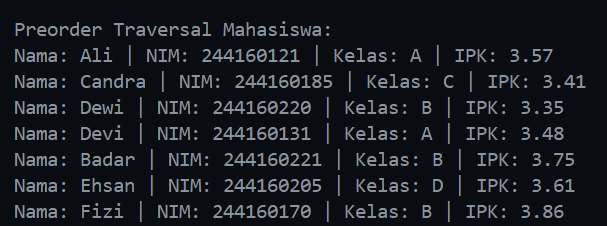

|  | Algorithm and Data Structure |
|--|--|
| NIM |  244107020116|
| Nama |  Savero Athallah Hardiana Putra |
| Kelas | TI - 1H |
| Repository | [https://github.com/Atherizz/asd-sem2/tree/main/Jobsheet%2013]|

# Labs #13 Tree

## Percobaan 1

### 2.1.2 Verifikasi Hasil Percobaan 
  
  

### 2.2.2 Pertanyaan
1. Karena data yang disimpan dalam binary search tree sudah diurutkan, jadi akan mempermudah proses pencarian, proses traverse tidak perlu menelusuri seluruh bagian tree sehingga dapat menghemat waktu.

2. attribute `left` berfungsi untuk menyimpan alamat memori node di bagian kiri node tersebut (anak kiri) sedangkan `right` berfungsi sebaliknya.

3. attribute `root` pada class `BinaryTree` berfungsi untuk menandai bagian teratas dari sebuah tree (parent utama)

4. value dari `root` akan diinisasi dengan node yang baru diinputkan

5. variabel parent digunakan untuk menyimpan nilai parent dari variabel current, nilai dari parent ini akan terus menyesuaikan berdasarkan current, terdapat 2 kondisi yang memungkinkan yaitu saat nilai ipk dari mahasiswa yang diinputkan lebih kecil maka nilai dari `parent.left` akan diisi dengan `newNode` dan sebaliknya. Hal ini dilakukan sesuai dengan aturan binary search tree

6. Method `getSuccessor()` membantu dalam proses ini dengan cara mencari node pengganti (successor) yang nilainya paling mendekati dan lebih besar dari node yang ingin dihapus, yaitu node paling kiri di subtree kanan. Setelah successor ditemukan, node tersebut akan menggantikan posisi node yang dihapus. Jika node yang dihapus adalah root, maka root akan diganti dengan successor. Jika bukan root, maka parent dari node yang dihapus akan menunjuk ke successor. Agar struktur binary search tree tetap valid, anak kiri dari node yang dihapus disambungkan ke kiri successor, karena successor tidak memiliki anak kiri (sebab dia adalah node paling kiri di subtree kanan). Dengan cara ini, pohon tetap terjaga urutannya setelah proses penghapusan selesai.

## Percobaan 2

### 3.1.2 Verifikasi Hasil Percobaan
  

### 3.2.2 Pertanyaan
1. `idxLast` digunakan untuk menyimpan index terakhir dari `dataMhs`, attribute ini diperlukan untuk membatasi traverse supaya berhenti sampai di `idxLast`

2. method `populateData` digunakan untuk menyimpan array `dataMhs` yang sudah diisi oleh beberapa objek dan menyimpan informasi `idxLast`

3. method `traverseInOrder` digunakan untuk melakukan traverse secara berurutan dengan menggunakan formula yang sudah ditentukan, baik untuk anak kiri dan anak kanan

4. node pada index 2
left child = 2 * 2 + 1 = 5
right child = 2 * 2 + 2 = 6

5. untuk membatasi traverse saat digunakan di method `traverseInOrder` supaya tidak melebihi batas array yang terisi

6. karena dengan formula tersebut otomatis akan didapatkan nilai dari anak kiri dan anak kanan dari node tersebut.

## Tugas Praktikum

1. method addRekursif
  

2. method mencari `minIpk` dan `maxIpk`
  

3. method menampilkan mahasiswa dengan ipk diatas input tertentu
  

4. method `addData` 
  

5. method `preOrderTraverse` untuk binary tree array
  

