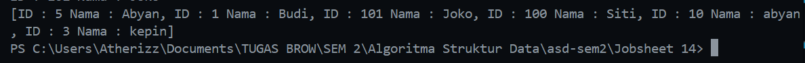

|  | Algorithm and Data Structure |
|--|--|
| NIM |  244107020116|
| Nama |  Savero Athallah Hardiana Putra |
| Kelas | TI - 1H |
| Repository | [https://github.com/Atherizz/asd-sem2/tree/main/Jobsheet%2014]|

# Labs #15 Collection

## Arraylist

### Pertanyaan
4. Cobalah tambahkan object customer baru ke dalam customers. Apakah object dapat ditambahkan meskipun melebihi kapasitas?
- bisa ditambahkan, karena itu hanyalah inisiasi awal

5. Compile dan run kode program, di mana object yang baru ditambahkan? Di awal, di tengah, atau di akhir collection?
- di akhir

7. Compile dan run kode program. Index pada ArrayList dimulai dari 0 atau 1?
- dari indeks 0

10. Cobalah hapus angka 2 saat instansiasi object customers. Apakah ArrayList dapat diinstansiasi tanpa harus menentukan size di awal?
- bisa tanpa inisiasi size

11. Menambahkan seluruh object customer sekaligus
```java
        ArrayList<Customer> newCustomers = new ArrayList<>();
        newCustomers.add(new Customer(100, "Siti"));
        newCustomers.add(new Customer(101, "Joko"));

        customers.addAll(newCustomers);
```

### Verifikasi Hasil Percobaan 
  


## Stack

### Pertanyaan
5. Mengapa perlu ada pengecekan (temp != null)? 
- Karena jika datanya null saat kita pop akan error karena mengembalikan null

6. Bagaimana cara melakukan pencarian elemen pada stack menggunakan method search()?
- Dengan cara memanggil method search pada objek yang tipe datanya arraylist stack dan parameternya diisi dengan nilai data yang mau dicari, dan nantinya akan mengembalikan index dari nilai tersebut

### Verifikasi Hasil Percobaan 
  

## Tree Set
4. Compile dan run program. Mengapa urutan yang ditampilkan berbeda dengan urutan 
penambahan data ke dalam TreeSet fruits? 
- Karena Tree set secara otomatis menyimpan elemen dalam urutan dari kecil ke besar (kalau abjad dari a - z). Konsepnya hampir mirip seperti binary search tree

6. Apa yang dilakukan oleh method first(), last(), remove(), pollFirst(), dan pollLast()?
- `first()`: mengembalikan elemen pertama (terkecil) dalam TreeSet.
- `last()` : Mengembalikan elemen terakhir (terbesar) dalam TreeSet.
- `remove(Object o)` : Menghapus elemen tertentu dari TreeSet jika ada.
- `pollFirst()` : Mengambil dan menghapus elemen pertama (terkecil) dari set.
- `pollLast()` : Mengambil dan menghapus elemen terakhir (terbesar) dari set.

## Sorting

### Verifikasi Hasil Percobaan 
  


