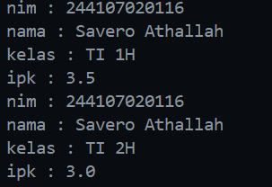
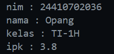
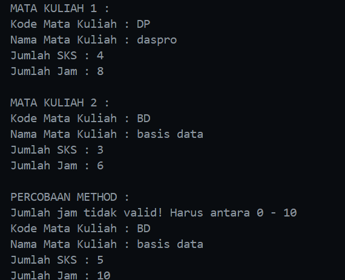
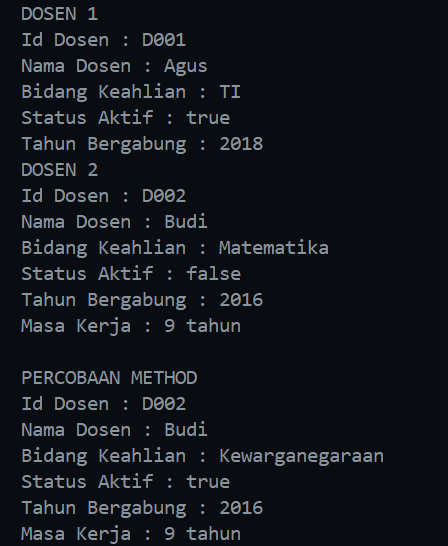

|  | Algorithm and Data Structure |
|--|--|
| NIM |  244107020116|
| Nama |  Savero Athallah Hardiana Putra |
| Kelas | TI - 1H |
| Repository | [https://github.com/Atherizz/asd-sem2/tree/main/Jobsheet%202]  |

# Labs #2 Object

## Percobaan 1

### 2.2.2 Verifikasi Hasil Percobaan 

 


### 2.2.3 Pertanyaan
1. Karakteristik Class dan Object:
- memiliki method
- memiliki property

2. Terdapat 4 atribut, diantaranya `nim`, `nama`, `kelas`, `ipk`

3. Terdapat 4 method, diantaranya `tampilkanInformasi()`, `ubahKelas()`, `updateIpk()`, `nilaiKerja()`

4.
 

5. Cara kerja method `nilaiKinerja()` adalah membandingkan value dari atribut `ipk` yang diinputkan oleh user di class `main` dan me return string sesuai kondisi yang telah ditentukan

## Percobaan 2

### 2.2.2 Verifikasi Hasil Percobaan 
 

### 2.2.3 Pertanyaan

1. Proses Instansiasi -> nama objek (mhs1)
 ```java
Mahasiswa mhs1 = new Mahasiswa();
```

2. menggunakan dot notation (.) setelah menulis nama objek

3. Karena telah dilakukan update ipk dan kelas menggunakan method `updateIpk()` dan `updateKelas()` sehingga value ipk dan kelas berubah sesuai input dari user

## Percobaan 3

### 2.2.2 Verifikasi Hasil Percobaan 
 

### 2.2.3 Pertanyaan
1. 
 ```java
    Mahasiswa (String nm, String nim, double ipk, String kls) {
        nama = nm;
        this.nim = nim;
        this.ipk = ipk;
        kelas = kls;
    }
```

2. Melakukan instansiasi dengan konstruktor sehingga atribut bisa dideklarasikan sekaligus saat object di instansiasi

3. Akan menyebabkan error karena constructor berparameter akan dijadikan constructor default, sehingga saat instansiasi objek diharuskan untuk mengisi parameter

4. Tidak, karena method di dalam class `Mahasiswa` dapat diakses secara acak atau tidak berurutan, tidak ada ketergantungan antar method sehingga dapat diakses secara bebas.

5. 
 ```java
    Mahasiswa mhsSavero = new Mahasiswa ("Savero", "244107020116", 3.6, "TI-1H");
    mhsSavero.updateIpk(3.9);
    mhsSavero.tampilkanInformasi();
```
## Latihan Praktkum

**1. Class MataKuliah**

 

 **Penjelasan Kode:**

1. **Mendeklarasikan variabel untuk menyimpan data mata kuliah:**  
   Kelas `MataKuliah25` memiliki atribut seperti `kodeMk`, `nama`, `sks`, dan `jumlahJam` untuk menyimpan informasi tentang mata kuliah.

2. **Menginisialisasi objek mata kuliah:**  
   Objek `mk1` dibuat menggunakan constructor default, lalu atributnya diisi secara manual. Objek `mk2` dibuat menggunakan constructor dengan parameter untuk langsung menginisialisasi data.

3. **Menampilkan informasi mata kuliah:**  
   Metode `tampilkanInformasi()` digunakan untuk mencetak data mata kuliah, seperti kode mata kuliah, nama, jumlah SKS, dan jumlah jam.

4. **Mengubah data mata kuliah:**  
- Metode `ubahSks(int sksBaru)` digunakan untuk mengubah jumlah SKS mata kuliah.  
- Metode `tambahJam(int jam)` menambahkan jumlah jam mata kuliah.  
- Metode `kurangiJam(int jam)` mengurangi jumlah jam, dengan validasi agar pengurangan tidak melebihi jumlah jam yang tersedia.

5. **Menampilkan hasil perubahan:**  
   Setelah memanggil metode untuk mengubah data (`ubahSks`, `tambahJam`, dan `kurangiJam`), informasi mata kuliah diperbarui dan ditampilkan kembali dengan metode `tampilkanInformasi()`.


**2. Class Dosen**

 

 **Penjelasan Kode:**

1. **Mendeklarasikan variabel untuk menyimpan data dosen:**  
   Kelas `Dosen25` memiliki atribut seperti `idDosen`, `nama`, `bidangKeahlian`, `statusAktif`, dan `tahunBergabung`. Atribut ini digunakan untuk menyimpan informasi tentang dosen.

2. **Menginisialisasi objek dosen:**  
   Objek `dsn1` dibuat menggunakan constructor dengan parameter, sedangkan `dsn2` dibuat menggunakan constructor default lalu nilai atributnya diatur secara manual.

3. **Menampilkan informasi dosen:**  
   Metode `tampilkanInformasi()` digunakan untuk mencetak detail dosen, seperti ID, nama, bidang keahlian, status aktif, dan tahun bergabung.

4. **Mengubah data dosen:**  
   Objek `dsn2` mengalami perubahan status aktif menggunakan metode `setStatusAktif()` dan perubahan bidang keahlian menggunakan metode `ubahKeahlian()`.

5. **Menghitung masa kerja dan menampilkan hasil:**  
   Metode `hitungMasaKerja(int tahunSkrg)` digunakan untuk menghitung selisih antara tahun saat ini (2025) dengan tahun bergabung. Hasilnya ditampilkan bersama informasi terbaru setelah perubahan atribut.


