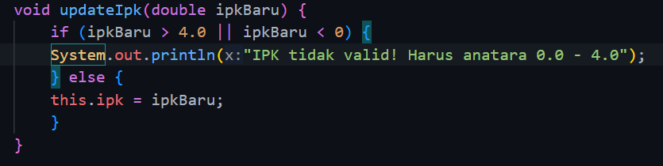

|  | Algorithm and Data Structure |
|--|--|
| NIM |  244107020116|
| Nama |  Savero Athallah Hardiana Putra |
| Kelas | TI - 1H |
| Repository | [link] () |

# Labs #2 Object

## Percobaan 1

### 2.2.2 Verifikasi Hasil Percobaan 

 


### 2.2.3 Pertanyaan
1. Karakteristik Class dan Object:
- memiliki method
- memiliki property

2. Terdapat 4 atribut, diantaranya nim, nama, kelas, ipk

3. Terdapat 4 method, diantaranya tampilkanInformasi, ubahKelas, updateIpk, nilaiKerja

4.
 

5. Cara kerja method nilaiKinerja adalah membandingkan value dari atribut ipk yang diinputkan oleh user di class main dan me return string sesuai kondisi yang telah ditentukan

## Percobaan 2

### 2.2.2 Verifikasi Hasil Percobaan 
 

### 2.2.3 Pertanyaan

1. Proses Instansiasi -> nama objek (mhs1)
 ```java
Mahasiswa mhs1 = new Mahasiswa();
```

2. menggunakan dot notation (.) setelah menulis nama objek

3. Karena telah dilakukan update ipk dan kelas menggunakan method updateIpk dan updateKelas sehingga value ipk dan kelas berubah sesuai input dari user

## Percobaan 3

### 2.2.2 Verifikasi Hasil Percobaan 
 

### 2.2.3 Pertanyaan
1. 
 ```java
    Mahasiswa (String nm, String nim, double ipk, String kls) {
        nama = nm;
        this.nim = nim;
        this.ipk = ipk;
        kelas = kls;
    }
```

2. Melakukan instansiasi dengan konstruktor sehingga atribut bisa dideklarasikan sekaligus saat object di instansiasi

3. Akan menyebabkan error karena constructor berparameter akan dijadikan constructor default, sehingga saat instansiasi objek diharuskan untuk mengisi parameter

4. Tidak, karena method di dalam class Mahasiswa dapat diakses secara acak atau tidak berurutan, tidak ada ketergantungan antar method sehingga dapat diakses secara bebas.

5. 
 ```java
    Mahasiswa mhsSavero = new Mahasiswa ("Savero", "244107020116", 3.6, "TI-1H");
    mhsSavero.updateIpk(3.9);
    mhsSavero.tampilkanInformasi();
```


