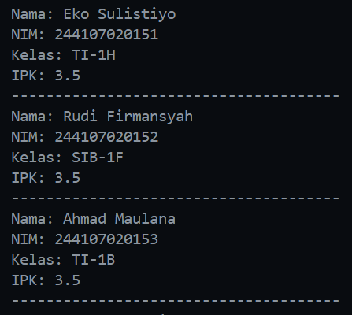
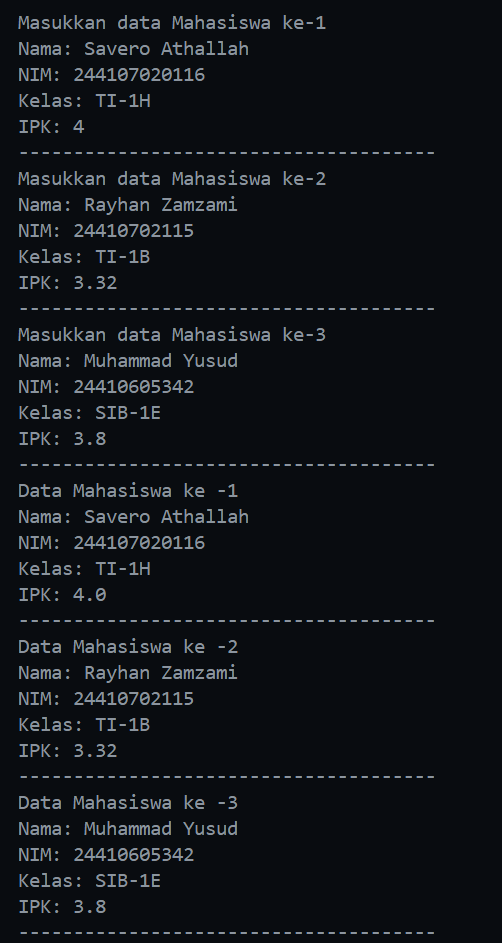

|  | Algorithm and Data Structure |
|--|--|
| NIM |  244107020116|
| Nama |  Savero Athallah Hardiana Putra |
| Kelas | TI - 1H |
| Repository | [https://github.com/Atherizz/asd-sem2/tree/main/Jobsheet%203]  |

# Labs #2 Array of Objects

## Percobaan 1 - Membuat Array dari Objek

### 3.2.2 Verifikasi Hasil Percobaan 

 

### 3.2.3 Pertanyaan
1. Tidak, `Class` tidak harus selalu memiliki atribut dan method. Class dapat memiliki hanya atribut, hanya method, atau bahkan tidak memiliki atribut dan method sama sekali. 

2. Melakukan inisialisasi array dengan tipe data sebuah class bernama `Mahasiswa` dan jumlah elemennya berjumlah 3

3. class `Mahasiswa` tidak memiliki konstruktor, tetapi secara default jika kita membuat class tanpa konstruktor maka `java` akan otomatis membuat konstruktor default tanpa parameter sehingga objek tetap bisa diinstansiasi

4. Kode program tersebut mengisi nilai pada seluruh atribut yang ada di dalam objek pada sebuah array yang ber index 0

5. Class `Mahasiswa` dan `MahasiswaDemo` dipisahkan karena class MahasiswaDemo berisi method main, dan pada Java, method main harus berada dalam sebuah public class yang memiliki nama yang sama dengan nama file.

## Percobaan 2 - Menerima Input Isian Array

### 3.2.2 Verifikasi Hasil Percobaan 

 

 ### 3.3.3 Pertanyaan

 1. Tambah method cetakInfo()
 ```java
void cetakInfo() {
        System.out.println("NIM : " + this.nim);
        System.out.println("Nama : " + this.name);
        System.out.println("Kelas : " + this.kelas);
        System.out.println("IPK : " + this.ipk);
    }
 ```

```java
for (int i = 0; i < arrayOfMahasiswa.length; i++) {
            System.out.println("Data Mahasiswa ke -" + (i + 1));
            arrayOfMahasiswa[i].cetakInfo();
            System.out.println("--------------------------------------");
        }
```

2. Karena objek pada index 0 `myArrayOfMahasiswa` belum diinstansiasi, sehingga menyebabkan error

## Percobaan 3 - Constructor Berparameter

### 3.4.2 Verifikasi Hasil Percobaan 

 

 ### 3.4.3 Pertanyaan

 1. Suatu class bisa memiliki lebih dari 1 constructor, asalkan tiap constructor memiliki parameter yang berbeda
 2. method `tambahData()`
 3. method 'cetakInfo()`
 4. modifikasi jumlah elemen sesuai input

  ### Tugas

**Tugas 1**

**Penjelasan Kode:**

1. **Mendeklarasikan variabel untuk menyimpan data dosen:**  
   Kelas `Dosen25` memiliki atribut `kode`, `nama`, `jenisKelamin` (Boolean), dan `usia` untuk menyimpan informasi dosen. Scanner `sc` juga dideklarasikan untuk menerima input dari pengguna.

2. **Membuat konstruktor untuk inisialisasi data:**  
   - Konstruktor default `Dosen25()` dibuat tanpa parameter.  
   - Konstruktor `Dosen25(String kode, String nama, Boolean jenisKelamin, int usia)` digunakan untuk langsung menginisialisasi data dosen saat objek dibuat.

3. **Menambahkan data dosen melalui metode `tambahData()`:**  
   - Pengguna diminta memasukkan `kode`, `nama`, `jenisKelamin`, dan `usia`.  
   - Input `jenisKelamin` divalidasi agar hanya menerima "pria" atau "wanita".  
   - Jika input "pria", maka `jenisKelamin = true`; jika "wanita", maka `jenisKelamin = false`.

4. **Mencetak informasi dosen dengan metode `cetakInfo()`:**  
   - Data yang telah disimpan akan ditampilkan.  
   - `jenisKelamin` yang berupa Boolean dikonversi menjadi string "Pria" atau "Wanita".  

**Tugas 2**

**Penjelasan Kode:**

1. **Deklarasi Atribut**  
   - `Dosen25[] dosen` → Array untuk menyimpan data dosen.  
   - `String[] gender` → Array untuk menyimpan jenis kelamin dosen dalam bentuk string.  
   - `int dosenPria = 0` → Variabel untuk menghitung jumlah dosen pria.  
   - `int dosenWanita = 0` → Variabel untuk menghitung jumlah dosen wanita.  

2. **Konstruktor**  
   - Menerima array `dosen` sebagai parameter dan menyimpannya ke atribut `this.dosen`.  
   - Menginisialisasi array `gender` dengan panjang yang sama seperti `dosen`.  

3. **Method `dataSemuaDosen`**  
   - Menampilkan semua data dosen dalam array yang diberikan.  
   - Menggunakan perulangan `for-each` untuk membaca setiap objek `Dosen25`.  
     - Jenis kelamin (diambil dari atribut `jenisKelamin` dengan nilai `true` untuk "Pria" dan `false` untuk "Wanita").  
   - Setiap iterasi, variabel `i` digunakan untuk melacak indeks dosen dan bertambah satu setiap loop.  

4. **Method `jumlahDosenPerJenisKelamin`**  
   - Menghitung jumlah dosen pria dan wanita dengan cara:  
     - Jika `jenisKelamin` bernilai `true`, jumlah dosen pria bertambah.  
     - Jika `jenisKelamin` bernilai `false`, jumlah dosen wanita bertambah.  
   - Menampilkan jumlah total dosen pria dan wanita.  

5. **Method `rerataUsiaDosenPerJenisKelamin`**  
   - Menghitung rata-rata usia dosen pria dan wanita.  
   - Menggunakan perulangan untuk menjumlahkan usia dosen berdasarkan jenis kelamin.  
   - Menghindari pembagian dengan nol dengan pengecekan apakah jumlah dosen pria atau wanita lebih dari nol sebelum perhitungan.  
   - Menampilkan rata-rata usia dosen pria dan wanita.  

6. **Method `infoDosenPalingTua`**  
   - Menentukan dosen dengan usia tertua dalam array.  
   - Menggunakan variabel `dosenTertua` untuk menyimpan usia tertua yang ditemukan.  
   - Menggunakan variabel `indexDosen` untuk menyimpan indeks dosen tertua.  
   - Menampilkan nama dan usia dosen tertua.  

7. **Method `infoDosenPalingMuda`**  
   - Menentukan dosen dengan usia termuda dalam array.  
   - Menggunakan variabel `dosenTermuda` yang awalnya di-set ke angka besar (`1000`) sebagai acuan.  
   - Menggunakan variabel `indexDosen` untuk menyimpan indeks dosen termuda.  
   - Menampilkan nama dan usia dosen termuda.  


  


