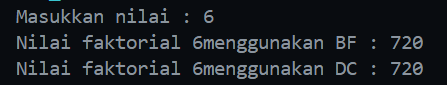
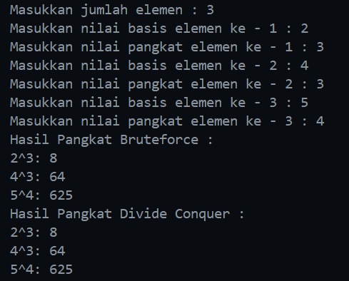
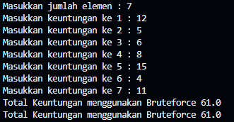
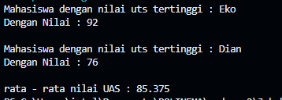

|  | Algorithm and Data Structure |
|--|--|
| NIM |  244107020116|
| Nama |  Savero Athallah Hardiana Putra |
| Kelas | TI - 1H |
| Repository | [https://github.com/Atherizz/asd-sem2/tree/main/Jobsheet%204]  |

# Labs #4 Brute Force Dan Divide Conquer

## Percobaan 1 - Menghitung Nilai Faktorial

### 5.2.2 Verifikasi Hasil Percobaan 

 

### 5.2.3 Pertanyaan
1. Pada blok kode `if` pada method tsb digunakan sebagai base case pada fungsi rekursif, yang berfungsi untuk menghentikan rekursif pada kondisi tertentu, dalam kasus ini perhitungan faktorial akan berhenti ketika n = 1, dan blok `else` digunakan untuk recursive call untuk memanggil fungsi `faktorialDC` sampai base case terpenuhi.

2. Bisa menggunakan while loop
```java
    int faktorialBFWhile(int n) {
        int fakto = 1;
        int i = 1;
        while (i <= n) {
            fakto *= i;
            i++;
        }
        return fakto;
    }
```

3. Perbedaan assignment dan rekursif

   a. ***fakto *= i***
merupakan perkalian assignment, yaitu mengalikan nilai fakto dengan i dan menyimpan hasilnya kembali ke fakto.

   b. ***fakto = n * faktorialDC(n-1)***
menggunakan pemanggilan fungsi rekursif faktorialDC dengan argumen n-1, kemudian mengalikan hasilnya dengan n dan menyimpan hasilnya ke fakto

4. Kesimpulan: `faktorialBF()` menggunakan perulangan untuk menghitung nilai faktorial, sedangkan `faktorialDC()` menggunakan pemanggilan fungsi diri sendiri untuk menghitung nilai faktorial.

## Percobaan 2 - Menghitung Nilai Pangkat

### 5.3.2 Verifikasi Hasil Percobaan 

 

### 5.3.3 Pertanyaan
1. Perbedaan `pangkatBF`dan `pangkatDC`

a. method `pangkatBF` menggunakan pendekatan iteratif (Brute Force) dengan melakukan operasi perkalian sebanyak `n` kali

b. method `pangkatDC` menggunakan pendekatan rekursif (Divide and Conquer) dengan membagi masalah menjadi dua submasalah yang lebih kecil dan menggabungkan hasilnya, sehingga lebih efisien untuk nilai `n` yang besar.

2. Tahap combine sudah termasuk dalam method pangkatDC. Pada method tersebut, tahap combine dilakukan ketika hasil dari dua panggilan rekursif dikalikan kembali untuk menghasilkan nilai pangkat yang diinginkan, baik untuk kasus `n` ganjil maupun genap.

3. Bisa menggunakan parameter dan juga tanpa parameter, jika tanpa parameter kode akan jadi seperti ini

```java
    int pangkatBF2NoParam () {
        int result = 1;
        for (int i = 0; i < pangkat; i++) {
            result *= nilai;
        }
        return result;
    }
```
4.Cara Kerja Method

a. Method `pangkatBF()`: Method pangkatBF bekerja dengan melakukan operasi perkalian sebanyak n kali, dimulai dari result yang bernilai 1 dan mengalikannya dengan a pada setiap iterasi hingga n iterasi selesai

b. Method `pangkatDC()`: Method pangkatDC bekerja dengan membagi masalah menjadi dua submasalah yang lebih kecil. Jika n sama dengan 1, ia mengembalikan a sebagai base case. Untuk n ganjil, ia memanggil dirinya sendiri dua kali dengan n/2 dan mengalikan hasilnya dengan a, sementara untuk n genap, ia hanya mengalikan hasil dari dua panggilan rekursif dengan n/2.

## Percobaan 3 - Menghitung Sum Array

### 5.4.2 Verifikasi Hasil Percobaan 

 

 ### 5.4.3 Pertanyaan

1. Karena variabel `mid` digunakan untuk mengambil nilai tengah dari array yang akan dibagi menjadi 2 supaya pembagian kedua bagian array rata jumlahnya. Value dari variabel mid akan terus berubah seiring berjalannya rekursif hingga mencapai base case

2. `leftSum` dan `rightSum` digunakan untuk melakukan recursive call dengan mendeklarasikan dua variabel yaitu untuk menyimpan bagian kiri dan kanan sebuah potongan array

3. Penjumlahan `leftSum` dan `rightSum` diperlukan untuk menggabungkan hasil perhitungan total nilai elemen di bagian kiri dan kanan subarray, sehingga mendapatkan total nilai elemen dalam subarray secara keseluruhan.

4. Base Case pada method tersebut adalah ketika nilai variabel `l` dan `r` sama, lalu mengembalikan nilai yang ada pada elemen  `l` atau `r`

```java
 if (l == r) {
            return arr[l];
        }
```

5. Metode `totalDC()` bekerja dengan cara membagi subarray menjadi dua bagian, menghitung total nilai elemen di setiap bagian secara rekursif, dan kemudian menjumlahkan hasilnya untuk mendapatkan total nilai elemen dalam subarray secara keseluruhan.

## Latihan Praktikum

 

#### a) `nilaiUtsTertinggi`
- **Langkah-langkah**:
  1. Jika hanya ada satu mahasiswa, kembalikan mahasiswa tersebut.
  2. Bagi array mahasiswa menjadi dua bagian.
  3. Cari nilai UTS tertinggi di kedua bagian.
  4. Bandingkan hasil dari kedua bagian dan kembalikan yang tertinggi melalui recursive call.

#### b) `nilaiUtsTerendah`
- **Langkah-langkah**:
  1. Jika hanya ada satu mahasiswa, kembalikan mahasiswa tersebut.
  2. Bagi array mahasiswa menjadi dua bagian.
  3. Cari nilai UTS terendah di kedua bagian.
  4. Bandingkan hasil dari kedua bagian dan kembalikan yang terendah melalui recursive call.

#### c) `rataRataUas`
- **Langkah-langkah**:
  1. Inisialisasi jumlah total nilai UAS.
  2. Iterasi melalui semua mahasiswa dan tambahkan nilai UAS ke total.
  3. Bagi total nilai UAS dengan jumlah mahasiswa untuk mendapatkan rata-rata.

