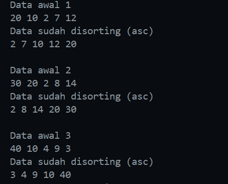
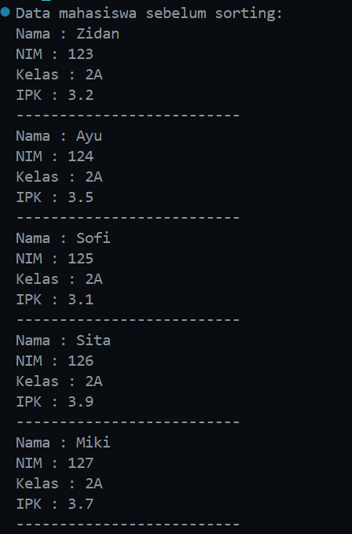
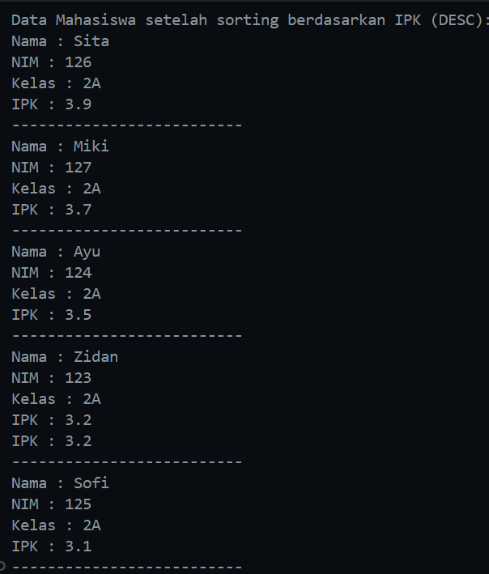
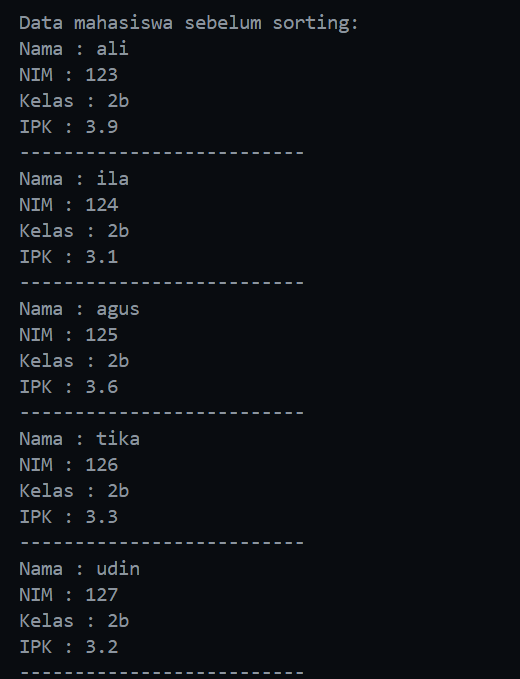
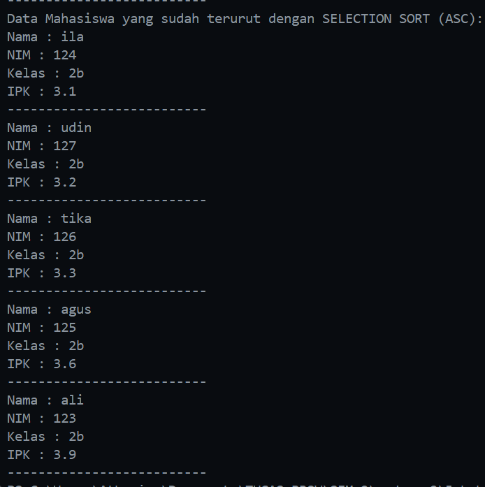
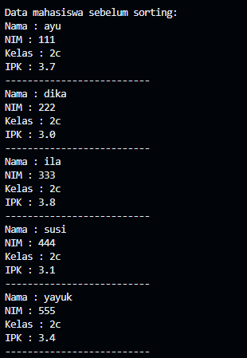
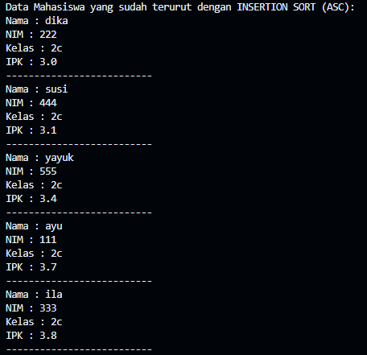
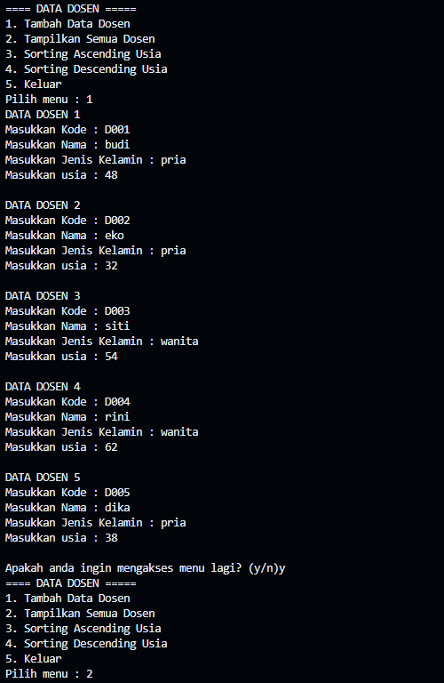
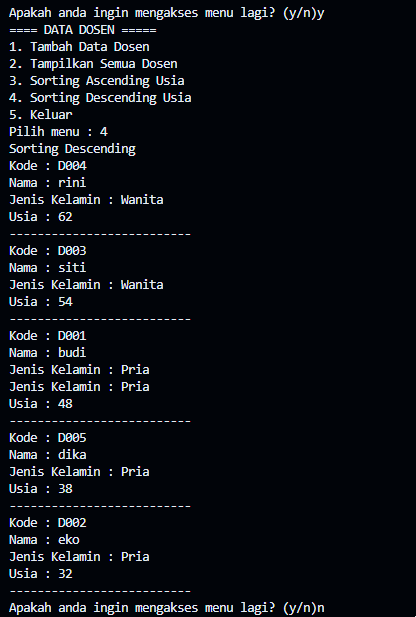

|  | Algorithm and Data Structure |
|--|--|
| NIM |  244107020116|
| Nama |  Savero Athallah Hardiana Putra |
| Kelas | TI - 1H |
| Repository | [https://github.com/Atherizz/asd-sem2/tree/main/Jobsheet%205]  |

# Labs #5 SORTING (BUBBLE, SELECTION, DAN INSERTION SORT)

## Percobaan 1 - Mengimplementasikan Sorting menggunakan object

### 5.2.2 Verifikasi Hasil Percobaan 

 

### 5.2.3 Pertanyaan
1. Dalam kode program tersebut dilakukan penukaran elemen pada array ketika kondisi `data[j-1]` > `data[j]` terpenuhi. Diperlukan variabel temp sebagai tempat penyimpanan variabel sementara karena pad java tidak bisa dilakukan penukaran nilai pada suatu variabel secara langsung

2. Kode Program algoritma pencarian nilai minimum pada selection sort
```java
            int min = 1;
            for (int j = i + 1; j < jumData; j++) {
                if (data[j] < data[min]) {
                    min = j;
                }
            }
```

3.Kondisi while pada insertion sort 
```java
while (j >= 0 && data[j] > temp)
```
Kondisi pada perulangan ini akan dijalankan selama nilai `j` >= 0 dan `data[j]` > `temp`, hal ini diperlukan supaya memenuhi syarat algoritma insertion sort yaitu data yang lebih besar akan terus digeser ke kanan hingga menemukan data yang lebih kecil daripada nilai `temp`

4. tujuan dari ```java data[j+1] = data[j] ``` adalah untuk mengisi variabel pada `data[j+1]` dengan `data[j]` atau sama saja dengan data sebelumnya, jadi pindah satu posisi ke kanan

## Percobaan 2 - Sorting Menggunakan Array of Object

### 5.3.2 Verifikasi Hasil Percobaan 

 
  

### 5.3.3 Pertanyaan

1. Perhatikan Kode Program
a. Loop luar (`i`) dilakukan sebanyak `n - 1` kali karena pada iterasi terakhir elemen sudah berada di posisi yang benar, jadi tidak perlu dicek lagi.  
b. Loop dalam (`j`) dilakukan sebanyak `n - i` kali karena setiap kali loop luar berputar, elemen terbesar sudah berada di akhir array. Jadi, jumlah perbandingan berkurang pada setiap iterasi berikutnya.  
c. Perulangan i akan terjadi sebanyak 49 kali (50-1). Pada setiap tahap iterasi tersebut, bubble sort memastikan bahwa satu elemen terbesar yang tersisa bergerak ke posisi akhirnya, sehingga setelah 49 tahap, semua elemen sudah terurut dengan benar. Jadi, jumlah tahap bubble sort sama dengan jumlah iterasi loop luar, yaitu 49 kali.

2. Modifikasi Program
```java
        for (int i = 0; i < 5; i++) {
            System.out.print("Masukkan NIM : ");
            String nim = sc.next();
            System.out.print("Masukkan Nama : ");
            String nama = sc.next();
            System.out.print("Masukkan Kelas : ");
            String kelas = sc.next();
            System.out.print("Masukkan IPK : ");
            double ipk = sc.nextDouble();
            Mahasiswa mhs = new Mahasiswa(nim, nama, kelas, ipk);
            list.tambah(mhs);
            System.out.println();
        }
```

### 5.3.4 Mengurutkan Data Mahasiswa menggunakan Selection Sort

### 5.3.5 Verifikasi Hasil Percobaan
 
  

### 5.3.6 Pertanyaan
1. Blok kode tersebut digunakan untuk mencari nilai terkecil pada suatu iterasi `j` dengan melakukan pengecekan antara atribut ipk pada array objek `listMhs[j]` dengan `listMhs[idxMin]`. Jika `listMhs[j]` maka value dari `idxMin` akan diisi dengan nilai `j`. Setelah melakukan pengecekan sampai akhir iterasi, elemen pada indeks `i` akan ditukar dengan elemen pada indeks `idxMin` agar elemen dengan nilai terkecil berada pada posisi yang benar dalam urutan yang diinginkan. Proses ini akan diulangi untuk setiap indeks `i`

### 5.4 Mengurutkan Data Mahasiswa menggunakan Insertion Sort

### 5.4.2 Verifikasi Hasil Percobaan 
 
  

### 5.4.3 Pertanyaan

Insertion Sort Descending

```java
    void insertionSortDescending() {
        for (int i = 1; i < listMhs.length; i++) {
            Mahasiswa temp = listMhs[i];
            int j = i-1;
            while (j >= 0 && listMhs[j].ipk < temp.ipk) {
                listMhs[j+1] = listMhs[j];
                j--;
            }
            listMhs[j+1] = temp;
        }
    }
}
```

### 5.5 Latihan Praktikum

### Output Program

 
  
   


