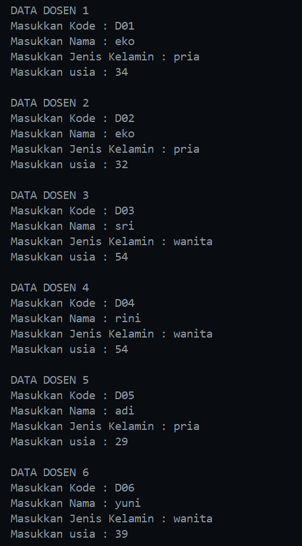

|  | Algorithm and Data Structure |
|--|--|
| NIM |  244107020116|
| Nama |  Savero Athallah Hardiana Putra |
| Kelas | TI - 1H |
| Repository | [https://github.com/Atherizz/asd-sem2/tree/main/Jobsheet%206]  |

# Labs #6 SEARCHING

## Searching / Pencarian Menggunakan Algoritma Sequential Search

### 6.2.2 Verifikasi Hasil Percobaan 

 
  

### 6.2.3 Pertanyaan
1. method `tampilDataSearch` digunakan untuk menampilkan seluruh atribut dari objek dengan index `pos`, yang didapatkan setelah melakukan searching, sedangkan method `tampilPosisi` hanya menampilkan posisi dari sebuah objek array yang telah dicari menggunakan method `sequentialSearch`

2. fungsi `break` pada method `sequentialSearch` adalah supaya ketika data sudah ditemukan, otomatis keluar dari perulangan dan langsung mengembalikan nilai `posisi`, dengan ini kode akan lebih efisien tanpa perlu mengecek seluruh data jika suatu nilai telah ditemukan

## Searching / Pencarian Menggunakan Algoritma Binary Search

### 6.3.2 Verifikasi Hasil Percobaan 

 

### 6.3.3 Pertanyaan
1. Proses Divide
```java
        if (left <= right) {
            mid = (left + right) / 2;
        }
```

2. Proses Conquer
```java
         if (cari == listMhs[mid].ipk) {
                return (mid);
            } else if (cari > listMhs[mid].ipk) {
                return findBinarySearch(cari, mid+1, right);
            } else {
                return findBinarySearch(cari, left, mid-1);
            }
```

3. Jika data tidak urut, program tidak akan sesuai dengan yang diharapkan, karena algoritma binary search menggunakan pendekatan melalui perbandingan antara nilai yang dicari dengan nilai yang berada di index `mid`  

4. Output tidak akan sesuai, diperlukan modifikasi program khususnya dalam pemanggilan rekursinya. Berikut adalah modifikasi programnya

```java
    int findBinarySearchDescending (double cari, int left, int right) {
        int mid;
        if (left <= right) {
            mid = (left + right) / 2;
            if (cari == listMhs[mid].ipk) {
                return (mid);
            } else if (cari > listMhs[mid].ipk) {
                return findBinarySearchDescending(cari, left, mid-1);
            } else {
                return findBinarySearchDescending(cari, mid+1, right);
            }
        } 
        return -1;
    }   
```

5. Modifikasi Program agar jumlah Mahasiswa sesuai output
```java
        System.out.print("Masukkan jumlah mahasiswa : ");
        int jmlMhs = sc.nextInt();

        while (jmlMhs > 5 || jmlMhs < 0) {
            System.out.println("Jumlah Mahasiswa max 5!");
            System.out.print("Masukkan jumlah mahasiswa : ");
            jmlMhs = sc.nextInt();
        }
```

### 6.5 Latihan Praktikum

### Input Data Dosen
 

### Sequential Search
 

### Sequential Search jika terdapat duplikat


### Binary Search


### Binary Search jika terdapat duplikat


### Penjelasan Kode Program

### **a) `pencarianDataSequential`**
- **Langkah-langkah**:
  1. Inisialisasi variabel `posisi` dengan `-1` (menandakan data tidak ditemukan).
  2. Iterasi melalui array `dataDosen` untuk mencari nama yang cocok dengan `target`.
  3. Jika ditemukan kecocokan, perbarui `posisi` dengan indeks saat ini dan tambahkan `counter`.
  4. Jika lebih dari satu hasil ditemukan (`counter > 1`), ubah nilai `posisi` menjadi `-2` (menandakan duplikasi).
  5. Kembalikan nilai `posisi`.

---

### **b) `pencarianDataBinary`**
- **Langkah-langkah**:
  1. Inisialisasi `counter` untuk menghitung jumlah kemunculan `target`.
  2. Menggunakan binary search untuk mencari `target` dalam array `arr` yang telah diurutkan.
  3. Jika ditemukan, simpan indeks `middle` ke `posIndex` dan tambahkan `counter`.
  4. Periksa elemen di kiri (`left`) dan kanan (`right`) dari `middle` satu persatu untuk melihat apakah ada duplikasi.
  5. Jika `counter` tetap `1`, kembalikan `posIndex`, jika lebih dari `1`, kembalikan `-2`, jika tidak ditemukan, kembalikan `-1`.

---

### **c) `tampilPosisi`**
- **Langkah-langkah**:
  1. Jika `pos` ≥ 0, tampilkan pesan bahwa data ditemukan di indeks tertentu.
  2. Jika `pos == -2`, tampilkan pesan bahwa data memiliki duplikat.
  3. Jika `pos == -1`, tampilkan pesan bahwa data tidak ditemukan.

---

### **d) Pencarian Data dalam Menu**
#### **Case 5: Cari Dosen Berdasarkan Nama**
- **Langkah-langkah**:
  1. User menginputkan `target nama`.
  2. Memanggil `pencarianDataSequential` untuk mencari nama dalam array `dataDosen`.
  3. Menampilkan hasil pencarian menggunakan `tampilPosisi`.
  4. Menampilkan detail data dengan `tampilDataSearch`.

#### **Case 6: Cari Dosen Berdasarkan Usia**
- **Langkah-langkah**:
  1. User menginputkan `target usia`.
  2. Mengurutkan `dataDosen` menggunakan `insertionSortAsc` agar dapat melakukan binary search.
  3. Memanggil `pencarianDataBinary` untuk mencari usia dalam array yang sudah diurutkan.
  4. Menampilkan hasil pencarian menggunakan `tampilPosisi`.
  5. Menampilkan detail data dengan `tampilDataSearch`.


