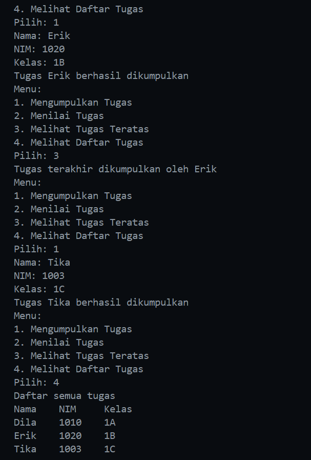
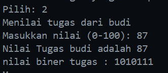
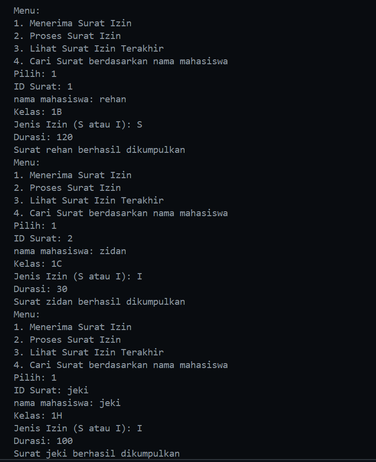
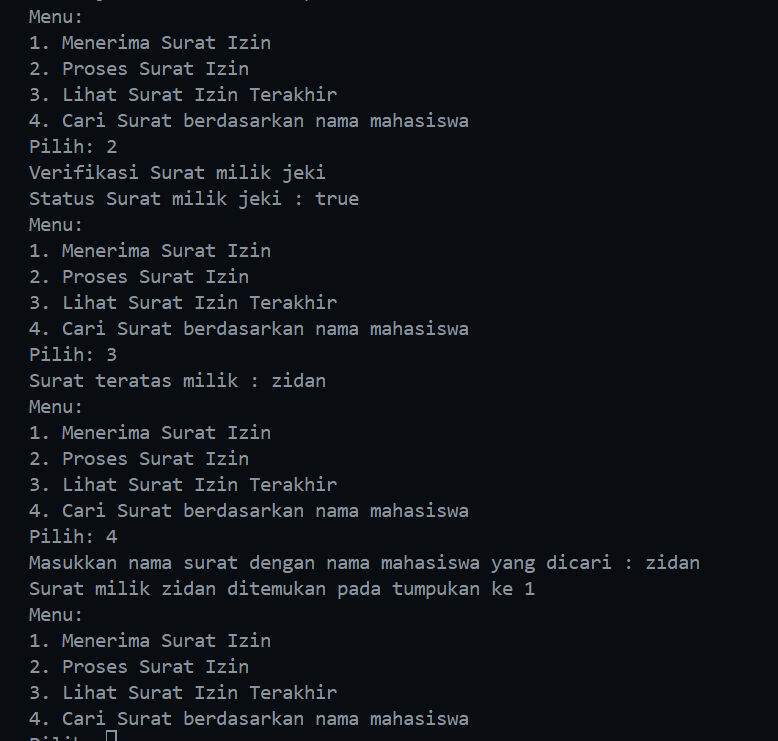

|  | Algorithm and Data Structure |
|--|--|
| NIM |  244107020116|
| Nama |  Savero Athallah Hardiana Putra |
| Kelas | TI - 1H |
| Repository | [https://github.com/Atherizz/asd-sem2/tree/main/Jobsheet%209]  |

# Labs #9 Stack

## Mahasiswa Mengumpulkan Tugas

### 2.1.2 Verifikasi Hasil Percobaan 

  

### 2.2.2 Pertanyaan
1. perubahan kode print
```java
    public void print() {
        for(int i = top; i >= 0; i--) {
            System.out.println(stack[i].nama + "\t" + stack[i].nim + "\t" + stack[i].kelas);
        }
        System.out.println("");
    }
```

2. Sejumlah data yang diinputkan saat menginisiasi objek `StackTugasMahasiswa25`, kalau dalam contoh menginputkan 5
```java
        StackTugasMahasiswa25 stack = new StackTugasMahasiswa25(5);
```

3. Karena jika tidak ada kondisi tersebut, akan menyebabkan error (index out of bounds) apabila dalam suatu kasus sebuah array telah terisi penuh dan tetap dipaksa untuk mengisi elemen pada array tsb

4. Tambahkan method melihat tugas pertama
```java
    Mahasiswa25 peekBottom() {
        if (!isEmpty()) {
            return stack[0];
        } else {
            System.out.println("Stack kosong! Tidak ada tugas yang dikumpulkan");
            return null;
        }
    }
```

5. Tambah method menghitung jumlah tugas
```java
    int jumlahTugas() {
        if (!isEmpty()) {
            return top + 1;
        } else {
            return 0;
        }
    }
```

## Konversi Nilai Tugas ke Biner

### 2.2.2 Verifikasi Hasil Percobaan 
  

### 2.2.3 Verifikasi Hasil Percobaan 
1. Pertama, sebuah objek `StackKonversi` dibuat untuk menyimpan sisa hasil pembagian bilangan desimal dengan 2. Selama nilai lebih besar dari 0, program akan menghitung sisa pembagian `nilai % 2`, lalu menyimpannya ke dalam stack menggunakan `stack.push(sisa)`. Nilai kemudian dibagi 2 menggunakan `nilai /= 2` untuk melanjutkan proses konversi. Setelah seluruh sisa pembagian disimpan dalam stack, program akan membentuk string biner dari data yang ada di stack. Ini dilakukan dengan cara mengambil satu per satu elemen dari stack menggunakan `stack.pop()` dan menambahkannya ke variabel `biner`. Karena stack bersifat LIFO (Last In First Out), hasil konversi yang terbentuk memiliki urutan biner yang benar. Setelah stack kosong, string biner yang terbentuk dikembalikan sebagai hasil konversi.

2. Input masih bisa dijalankan dan tetap sesuai logika, tetapi jika nilai yang diinputkan adalah negatif maka akan terjadi kemungkinan infinite loop atau hasil yang tidak valid

## Latihan Praktikum

  
    